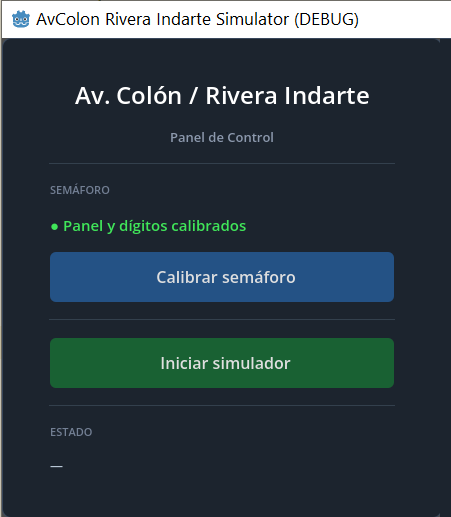
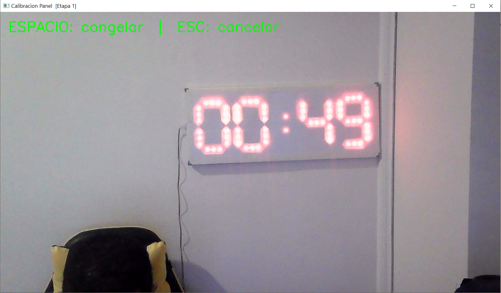
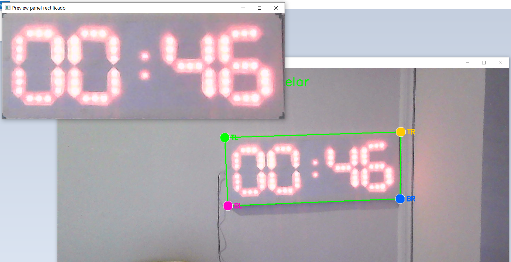
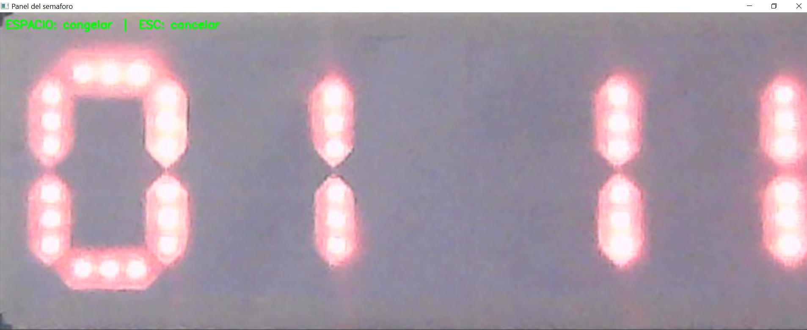
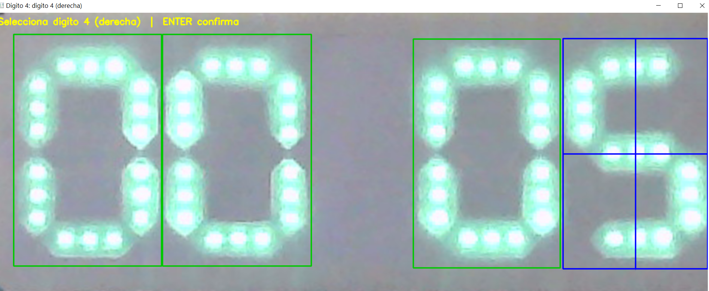
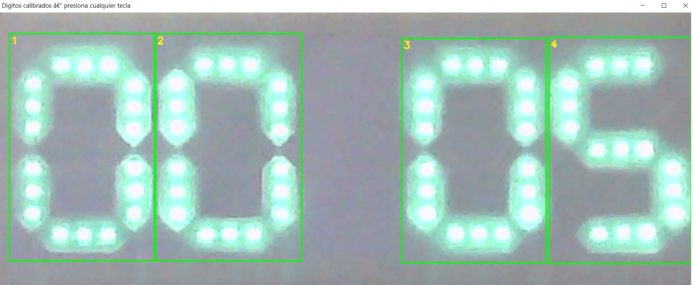
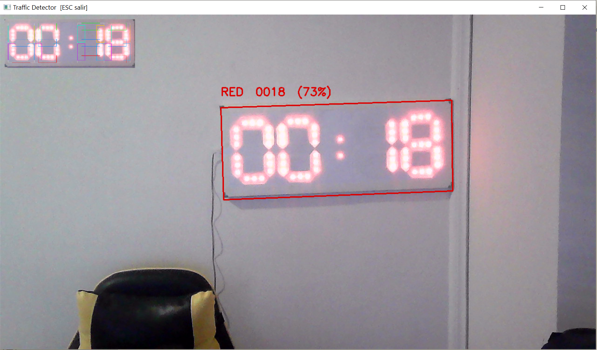
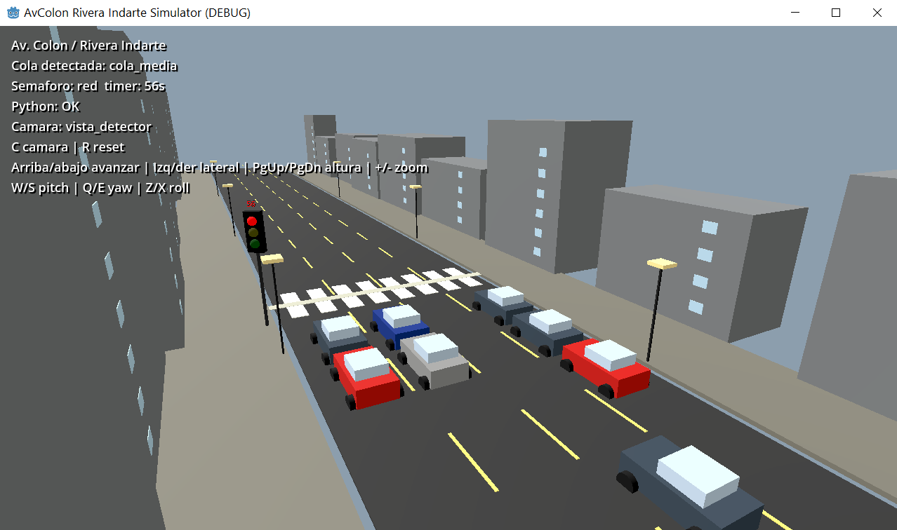
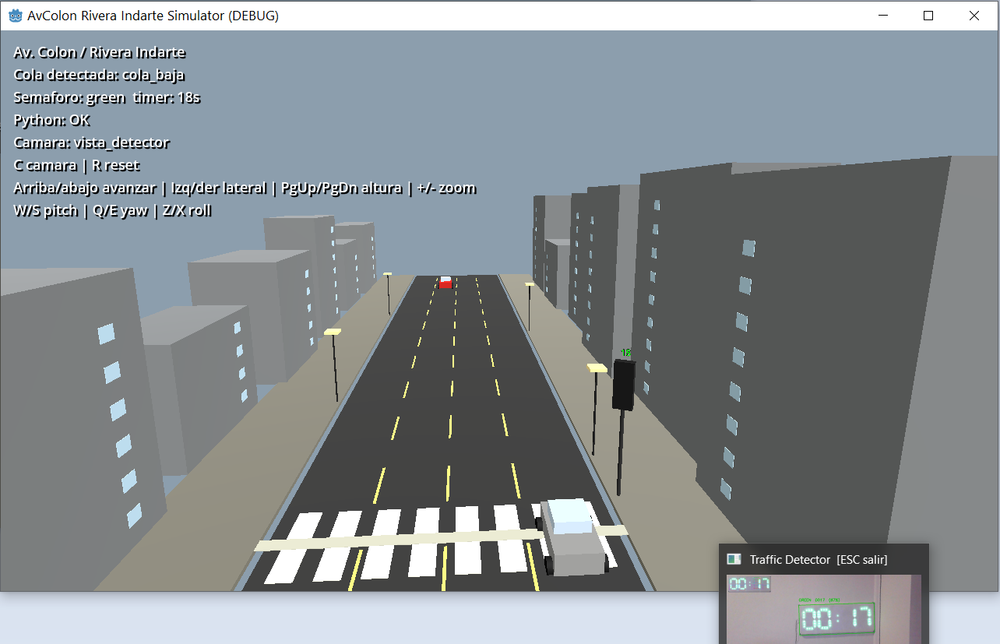

# Informe Técnico — Simulador de Tráfico como Banco de Pruebas para Control Semafórico por Visión Artificial

---

**Universidad Tecnológica Nacional — Facultad Regional Córdoba**
**Materia:** Introducción a la Visión Artificial
**Docente:** Alexis Gonzales
**Período:** Junio — Julio 2026

**Equipo:**
Casali, Emiliano · Del Soto, Gustavo · Ferrero, Facundo · Vera, Gonzalo

**Repositorio:** `controlTrafico_TPF_VA`

---

## Índice

1. [Introducción](#1-introducción)
2. [Razón de ser del simulador](#2-razón-de-ser-del-simulador)
3. [Objetivos](#3-objetivos)
4. [Alcance del recurso](#4-alcance-del-recurso)
5. [Descripción general del sistema](#5-descripción-general-del-sistema)
6. [Arquitectura funcional](#6-arquitectura-funcional)
7. [Desarrollo del recurso](#7-desarrollo-del-recurso)
8. [Uso dentro del TP Final](#8-uso-dentro-del-tp-final)
9. [Resultados esperados](#9-resultados-esperados)
10. [Limitaciones](#10-limitaciones)
11. [Posibles mejoras](#11-posibles-mejoras)
12. [Conclusión](#12-conclusión)
13. [Anexos](#13-anexos)

---

## 1. Introducción

El presente informe describe el desarrollo y la función de un simulador de tráfico urbano construido en Godot 4.6 como recurso experimental de soporte para el Trabajo Práctico Final de la materia Introducción a la Visión Artificial. Dicho TP Final tiene como objetivo central el diseño e implementación de un sistema de detección de cola vehicular mediante visión artificial, capaz de adaptar la lógica de un semáforo en función del estado del tránsito detectado.

El simulador no constituye el objetivo final del trabajo. Su función es proveer un entorno controlado, repetible y seguro donde sea posible generar condiciones de tráfico variables —colas bajas, medias, altas y flujo libre— y verificar si el algoritmo de control semafórico propuesto produce efectivamente una mejora en el flujo vehicular.

Este informe describe el funcionamiento del simulador, su arquitectura técnica, su integración con el módulo de visión artificial y su rol metodológico dentro del TP Final.

---

## 2. Razón de ser del simulador

### El problema de validar en escena real

Un sistema de control semafórico adaptativo por visión artificial puede observar el tránsito real, detectar vehículos y estimar colas. Sin embargo, en una intersección urbana real existen dos restricciones fundamentales que impiden su validación:

1. **No es posible intervenir el semáforo municipal.** Los semáforos de la ciudad de Córdoba están gestionados por sistemas de control de tránsito municipales. No existe interfaz disponible para modificar su ciclo en tiempo real desde un sistema experimental.

2. **No es posible controlar las condiciones del tránsito.** Aunque se coloque una cámara frente a una intersección real, el flujo vehicular es impredecible y no repetible. No se puede inducir deliberadamente una cola alta, mantenerla durante el tiempo necesario para la prueba, ni replicar las mismas condiciones en distintas ejecuciones del algoritmo.

Estas restricciones hacen que la validación en entorno real sea inviable para el alcance de un TP Final de grado.

### El simulador como solución metodológica

El simulador resuelve ambas restricciones:

- **Control total sobre el semáforo:** el estado y el ciclo del semáforo simulado pueden ser modificados en tiempo real por el módulo de visión artificial, a través de un archivo JSON compartido entre procesos.
- **Condiciones de tráfico controladas y repetibles:** el simulador genera flujos vehiculares de forma aleatoria pero parametrizable, permitiendo reproducir estados de cola baja, media, alta y flujo libre de forma deliberada.

El simulador cumple el rol de **banco de pruebas**. Permite cerrar el ciclo de control: visión artificial detecta el estado del tránsito → algoritmo de control decide el estado del semáforo → semáforo cambia → el tráfico responde → visión artificial vuelve a observar.

> **Distinción fundamental:**
> El TP Final no es construir un simulador de tráfico.
> El TP Final es detectar cola vehicular mediante visión artificial y adaptar un semáforo en función de esa detección.
> El simulador es la infraestructura necesaria para probar esa lógica sin depender de una intersección real.

---

## 3. Objetivos

### Objetivo general

Proveer un entorno de simulación de tráfico urbano que permita validar un algoritmo de detección de cola vehicular por visión artificial y su integración con un módulo de control semafórico adaptativo.

### Objetivos específicos

- Modelar una intersección urbana de cuatro carriles con comportamiento vehicular autónomo basado en modelo de seguimiento (car-following).
- Implementar un semáforo simulado con ciclo configurable cuyos estados puedan ser sobreescritos en tiempo real por un proceso externo.
- Detectar y clasificar el estado del semáforo físico LED real mediante visión artificial (color y dígitos del display).
- Sincronizar el estado del semáforo físico con el semáforo simulado a través de un mecanismo de comunicación entre procesos.
- Exponer métricas de cola vehicular (baja, media, alta, libre) que el sistema de control pueda leer para tomar decisiones.
- Proveer un launcher integrado que gestione la calibración del sistema y el arranque del simulador desde una interfaz unificada.

---

## 4. Alcance del recurso

El simulador representa la intersección de la Av. Colón con Rivera Indarte (Córdoba) de forma estilizada, no fotorrealista. Su propósito es funcional, no visual.

**Está dentro del alcance:**
- Cuatro carriles de circulación unidireccional.
- Generación aleatoria de vehículos con comportamiento de car-following (frenado ante el vehículo precedente y ante la línea de detención).
- Detección de nivel de cola por cantidad de vehículos en zona de aproximación al semáforo.
- Semáforo simulado en 3D con ciclo autónomo modificable externamente.
- Detección de color e OCR del semáforo físico LED real por cámara USB.
- Sincronización bidireccional: el semáforo físico controla el semáforo virtual.

**Está fuera del alcance:**
- Modelado físico de dinámica vehicular realista.
- Intersecciones múltiples o red vial compleja.
- Detección de vehículos reales por visión artificial (esa es la función del TP Final sobre la escena simulada).
- Comunicación con sistemas de control de tránsito municipales.

---

## 5. Descripción general del sistema

El sistema integra dos componentes principales que se ejecutan en paralelo:

### Componente 1 — Módulo de visión artificial (Python / OpenCV)

Analiza el feed de una cámara USB apuntada al semáforo LED físico. Extrae el estado de la luz (rojo, verde, amarillo) y el valor numérico del display de cuenta regresiva. Escribe esta información en un archivo JSON compartido (`config/traffic_state.json`) con escritura atómica para evitar condiciones de carrera.

### Componente 2 — Simulador 3D (Godot 4.6 / GDScript)

Renderiza la intersección con vehículos autónomos que responden al estado del semáforo. Lee el JSON cada 500 ms y actualiza el semáforo virtual en consecuencia. Detecta el nivel de cola actual y lo expone en el HUD. Este nivel de cola es la métrica que el algoritmo de control debe utilizar para decidir cuándo intervenir el semáforo.

### Launcher integrado

Una pantalla inicial unifica el flujo de trabajo: permite ejecutar la calibración del semáforo (en dos etapas: polígono del panel y bboxes de los dígitos) y lanzar el simulador con el detector activo, sin necesidad de abrir terminales manualmente.


*Figura 1 — Panel de control: estado de calibración y acceso al simulador.*

---

## 6. Arquitectura funcional

```
┌─────────────────────────────────────────────────────────────┐
│                     PROCESO PYTHON                          │
│                                                             │
│  Cámara USB (Red Dragon, índice 1)                         │
│       ↓  frame 1920×1080                                   │
│  warpPerspective → Panel rectificado 800×300               │
│       ↓                                                     │
│  Bright mask (canal V > 140)                               │
│       ├── Clasificador de color (cromaticidad → hue)       │
│       │        → estado: red / green / yellow              │
│       └── OCR 7 segmentos (CLAHE + Otsu + zonas)          │
│                → timer: "0049", "0018", etc.               │
│       ↓                                                     │
│  traffic_state.json  { state, timer, ts, confidence }      │
└──────────────────────┬──────────────────────────────────────┘
                       │ lectura cada 500 ms
┌──────────────────────▼──────────────────────────────────────┐
│                    PROCESO GODOT                            │
│                                                             │
│  PythonBridge → fuerza estado en TrafficLightController    │
│                                                             │
│  TrafficLightController ──→ VehicleController (×N)         │
│       (semáforo 3D)              (car-following)           │
│                                                             │
│  VehicleSpawner → detecta cola → expone detected_queue     │
│       └── FREE / cola_baja / cola_media / cola_alta        │
│                                                             │
│  HUD → muestra estado, timer, cola, estado Python          │
└─────────────────────────────────────────────────────────────┘
```

### Comunicación entre procesos

La integración entre Python y Godot se realiza mediante un archivo JSON en disco. Este mecanismo fue elegido por su simplicidad, portabilidad y compatibilidad con cualquier lenguaje o herramienta que pueda leer archivos de texto. No requiere sockets, pipes ni dependencias adicionales.

El archivo se escribe de forma atómica (escritura a archivo temporal + reemplazo) para evitar que Godot lea un JSON parcialmente escrito. En Windows, donde el reemplazo atómico puede fallar por bloqueo de archivos, existe un mecanismo de fallback a escritura directa.

---

## 7. Desarrollo del recurso

### 7.1 Calibración del semáforo físico

La calibración es específica de cada instalación y se ejecuta una sola vez por equipo. Se realiza en dos etapas consecutivas desde el launcher.

**Etapa 1 — Selección del polígono del panel**

El operador congela un frame de la cámara y ajusta cuatro vértices arrastrables sobre los bordes del panel LED. El sistema aplica una transformación de perspectiva (homografía) para rectificar el panel a una imagen de tamaño fijo (800×300 px), eliminando la distorsión por ángulo de cámara.


*Figura 2 — Vista de cámara al inicio de la calibración. El panel muestra 00:49.*


*Figura 3 — Editor interactivo de vértices. La ventana superior muestra el panel rectificado en tiempo real.*

**Etapa 2 — Selección de bboxes de dígitos**

Sobre el panel rectificado ampliado al doble de resolución, el operador selecciona con el mouse el bounding box de cada uno de los cuatro dígitos. Las coordenadas se almacenan en píxeles relativos al panel rectificado, desacopladas de la resolución de la cámara.


*Figura 4 — Selección de bboxes de dígitos. Los anteriores se muestran en verde a modo de referencia.*


*Figura 5 — Selección del cuarto dígito. El panel muestra 00:05.*


*Figura 6 — Resultado final: los cuatro dígitos marcados y numerados correctamente.*

Toda la información de calibración (índice de cámara, polígono, dimensiones del panel y bboxes de dígitos) se almacena en `config/roi.json`. Este archivo no se versiona en git, ya que es específico de cada instalación.

### 7.2 Detección de color del semáforo

La clasificación de color opera en dos pasos para tolerar las condiciones particulares de los paneles LED de tipo matriz de puntos, que emiten luz blanca o cálida con baja saturación cromática:

1. **Análisis de cromaticidad:** se calcula la fracción de píxeles brillantes con saturación suficiente para considerarse cromáticos. Si dicha fracción es menor a un umbral, la luz se clasifica como amarilla (los LEDs blancos/cálidos tienen S baja independientemente de su tono).

2. **Clasificación por hue:** entre los píxeles cromáticos brillantes, se determina el tono dominante. Los rangos `H ∈ [0°-14°] ∪ [161°-180°]` corresponden a rojo y `H ∈ [40°-105°]` a verde.

### 7.3 OCR de 7 segmentos

Cada dígito se procesa individualmente:

- Se aplica CLAHE (ecualización de histograma adaptativa con límite de contraste) para normalizar el brillo local ante variaciones de exposición.
- Se binariza con umbral de Otsu para obtener los segmentos activos.
- Se aplica apertura morfológica para eliminar artefactos entre segmentos.
- Se analiza cada una de las siete zonas de segmento (a-g) como fracción del bounding box. Una zona con más del 20% de píxeles activos se considera encendida.
- La combinación de segmentos activos se resuelve contra una tabla de verdad que mapea los siete patrones a los dígitos 0-9.


*Figura 7 — Detector en ejecución: clasifica el panel como RED con timer 0018 y confianza 73%. El thumbnail en la esquina superior izquierda muestra el panel rectificado.*

### 7.4 Simulador 3D

La escena 3D se construye íntegramente por código (sin assets externos) utilizando geometría primitiva. Incluye:

- **Calzada y veredas** con marcas viales y senda peatonal.
- **Edificios** con altura y posición aleatoria en cada ejecución.
- **Postes de iluminación** a ambos lados de la calzada.
- **Semáforo 3D** con las tres luces (rojo, amarillo, verde) y display de timer numérico.
- **Vehículos** generados dinámicamente, con modelo de cuerpo + cabina + ruedas, en colores aleatorios de una paleta urbana realista.

El comportamiento vehicular sigue un modelo de car-following basado en gap parachoques-a-parachoques: cada vehículo regula su velocidad en función de la distancia al vehículo precedente y, en fase roja, en función de la distancia a la línea de detención. Los vehículos que ya cruzaron la línea de detención continúan circulando aunque el semáforo esté en rojo.


*Figura 8 — Fase roja con cola media detectada. Los vehículos se acumulan antes de la senda peatonal.*


*Figura 9 — Fase verde con cola baja. Los vehículos circulan libremente. El detector Python se muestra activo en la esquina inferior derecha.*

### 7.5 Detección de nivel de cola

El spawner cuenta los vehículos presentes en la zona de aproximación al semáforo (entre z = -68 y z = -10 en el sistema de coordenadas de la escena) por carril. La suma total determina el nivel de cola expuesto al HUD y disponible para el módulo de control:

| Nivel | Condición |
|-------|-----------|
| `FREE` | 0-1 vehículos en total |
| `cola_baja` | 2-4 vehículos |
| `cola_media` | 5-8 vehículos |
| `cola_alta` | 9 o más vehículos |

---

## 8. Uso dentro del TP Final

El simulador se utiliza como entorno de validación del algoritmo de control semafórico del TP Final. El ciclo de uso es el siguiente:

1. **El semáforo físico LED** opera con su ciclo propio (rojo 45s, amarillo 5s, verde 30s o el ciclo real del semáforo bajo estudio).
2. **El módulo de visión artificial** analiza el panel LED en tiempo real, extrae estado y timer, y los escribe en `traffic_state.json`.
3. **El simulador Godot** lee el JSON y sincroniza su semáforo virtual con el físico. El tráfico simulado responde al semáforo.
4. **El módulo de control** (componente central del TP Final) lee el nivel de cola detectado por el simulador y decide si intervenir el semáforo físico o no.
5. **El ciclo se cierra:** si el algoritmo decide cambiar el estado del semáforo, lo hace a través del semáforo físico, cuyo cambio es captado por la cámara y propagado al simulador.

Este esquema permite probar distintas estrategias de control (umbral de cola, histéresis, tiempo mínimo de verde, etc.) sobre el simulador antes de implementarlas en escena real.

---

## 9. Resultados esperados

- El simulador debe reflejar fielmente el estado del semáforo físico con una latencia inferior a 1 segundo en condiciones normales de hardware.
- Los vehículos deben acumularse de forma natural ante el semáforo en rojo y dispersarse progresivamente al pasar a verde.
- El nivel de cola detectado debe variar dinámicamente y ser legible por el módulo de control externo.
- La calibración debe ser reproducible en cualquier PC con una cámara USB apuntada al panel, sin modificaciones de código.
- El sistema completo debe poder instalarse en una nueva PC en menos de 10 minutos siguiendo los pasos del `setup.bat`.

---

## 10. Limitaciones

| Limitación | Descripción |
|------------|-------------|
| Detección de amarillo frágil | Los LEDs blancos/cálidos tienen saturación baja. El umbral de cromaticidad puede confundirse ante cambios bruscos de autoexposición de la cámara. |
| OCR sensible a posición | Las zonas de segmento son fracciones fijas del bbox calibrado. Si el dígito no está perfectamente encuadrado o la perspectiva varía, el OCR puede fallar. |
| Sin suavizado temporal | Un frame ruidoso puede generar un cambio de estado espurio. No hay filtro de mayoría ni debounce implementado. |
| Bright mask con umbral fijo | El umbral `V > 140` puede ser superado por reflexiones o LEDs apagados bajo exposición alta de la cámara. |
| Física vehicular simplificada | El modelo car-following es una aproximación. No incluye cambio de carril, aceleración no lineal ni comportamiento ante emergencias. |
| Escena no fotorrealista | El entorno 3D es estilizado. No pretende representar con exactitud la geometría real de la intersección. |
| Comunicación por archivo JSON | La latencia de sincronización depende del sistema de archivos del SO. En condiciones de carga alta, puede superar el período de 500 ms. |

---

## 11. Posibles mejoras

### Visión artificial

- **Filtro temporal de mayoría:** acumular los últimos N frames y emitir el estado solo cuando hay consenso, reduciendo cambios espurios.
- **Calibración automática del umbral V:** medir el nivel de brillo de fondo y ajustar `V_THRESHOLD` dinámicamente en función de la autoexposición de la cámara.
- **OCR con red neuronal:** reemplazar el análisis de zonas por un clasificador CNN entrenado con dígitos del tipo de display específico, mejorando la robustez ante variaciones de ángulo y brillo.
- **Detección de panel por descriptor de color:** en lugar del polígono fijo, detectar el panel automáticamente en cada frame por su perfil de color y brillo, tolerando pequeños movimientos de cámara.

### Simulador

- **Detección de vehículos reales en la escena simulada:** integrar un algoritmo de detección de objetos (YOLO u OpenCV background subtraction) que opere sobre el render 2D del simulador, cerrando el ciclo completo dentro del entorno virtual.
- **Múltiples intersecciones:** ampliar la escena para modelar un corredor de varias intersecciones, permitiendo evaluar algoritmos de control coordinado.
- **Métricas cuantitativas:** registrar tiempos de espera promedio, throughput vehicular y longitud de cola en cada ciclo semafórico, para comparar estrategias de control.
- **Comunicación por socket:** reemplazar el archivo JSON por un socket UDP/TCP para reducir latencia y eliminar la dependencia del sistema de archivos.

---

## 12. Conclusión

El simulador desarrollado cumple su función como banco de pruebas para el sistema de control semafórico adaptativo por visión artificial. Permite generar condiciones de tráfico variables, sincronizar el estado del semáforo físico con el virtual mediante procesamiento de imagen en tiempo real, y exponer métricas de cola vehicular que el módulo de control puede utilizar para tomar decisiones.

La separación en dos procesos independientes (Python para visión y Godot para simulación) con comunicación por archivo JSON resulta robusta, portable y fácil de depurar. El mecanismo de calibración en dos etapas permite adaptar el sistema a cualquier instalación física sin modificaciones de código.

La arquitectura implementada demuestra que es posible construir un entorno de validación funcional con herramientas de código abierto (Godot, Python, OpenCV) y hardware de bajo costo (cámara USB). Este enfoque es replicable para otros escenarios de control inteligente de tránsito donde la intervención del semáforo real no sea factible durante la etapa de desarrollo y prueba.

---

## 13. Anexos

### A. Estructura del repositorio

```
controlTrafico_TPF_VA/
├── config/
│   ├── roi.json            ← calibración local (no versionado)
│   └── traffic_state.json  ← estado en tiempo real (no versionado)
├── docs/
│   ├── assets/             ← capturas del sistema en operación
│   ├── pipeline.md         ← documentación técnica del pipeline
│   ├── pipelineVA_fd51352.md ← snapshot del pipeline al commit fd51352
│   └── informe_simulador_controlTrafico.md ← este documento
├── scenes/
│   ├── launcher.tscn
│   └── main.tscn
├── scripts/                ← GDScript (Godot)
├── scriptsPy/              ← Python / OpenCV
├── setup.bat               ← instalación automática en nueva PC
├── requirements.txt
├── LICENSE
└── project.godot
```

### B. Parámetros de calibración actuales

| Parámetro | Valor |
|-----------|-------|
| Índice de cámara | 1 (Red Dragon) |
| Resolución de captura | 1920 × 1080 px |
| Tamaño del panel rectificado | 800 × 300 px |
| Umbral de brillo (V) | 140 / 255 |
| Umbral de cromaticidad (S) | 35 / 255 |
| Fracción mínima cromática | 18 % |
| Umbral de segmento activo | 20 % |

### C. Ciclo semafórico de referencia

| Fase | Duración |
|------|----------|
| Verde | 30 s |
| Amarillo | 5 s |
| Rojo | 45 s |

El ciclo puede ser sobreescrito en cualquier momento por el semáforo físico mediante el mecanismo de sincronización.

### D. Capturas del sistema en operación

| Figura | Descripción |
|--------|-------------|
| Fig. 1 | Panel de control del launcher con calibración completa |
| Fig. 2 | Vista de cámara al inicio de la calibración (00:49) |
| Fig. 3 | Editor interactivo de vértices del polígono del panel |
| Fig. 4 | Selección de bboxes de dígitos en progreso |
| Fig. 5 | Selección del cuarto dígito (00:05) |
| Fig. 6 | Los cuatro dígitos calibrados y numerados |
| Fig. 7 | Detector activo: RED, timer 0018, confianza 73% |
| Fig. 8 | Simulador en fase roja con cola media |
| Fig. 9 | Simulador en fase verde con cola baja y detector activo |
